# Physics-Informed Neural Networks (PINNs)

This repository contains implementations of Physics-Informed Neural Networks (PINNs) for solving classical partial differential equations (PDEs).  
PINNs integrate deep learning with physics constraints, ensuring that solutions satisfy governing laws such as conservation of mass, momentum, and energy.

---

## Problems Solved and Results

### 1. Heat Equation (1D)

The PDE is $u_t = \alpha^2 u_{xx}$ with $\alpha = 2$,  
IC: $u(x,0) = x^2(2-x)$,  
BC: $u(0,t) = 0, \; u(2,t) = 0$.  

**Result:**  
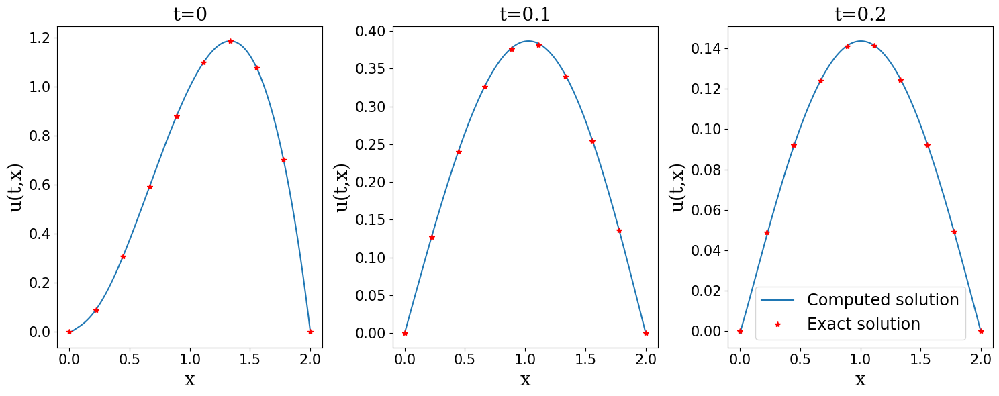

---

### 2. Heat Equation (2D)

The PDE is $u_t = \alpha^2 (u_{xx} + u_{yy})$ with $\alpha = 0.1$,  
IC: $u(x,y,0) = \sin(\pi x)\sin(\pi y)$,  
BC: $u(x,0,t) = u(x,1,t) = u(0,y,t) = u(1,y,t) = 0$.  

**Result:**  at t = 0
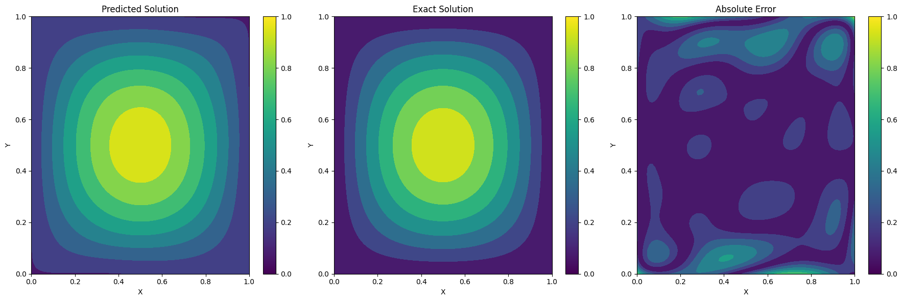

---

### 3. Advection Equation (2D)

The PDE is $u_t + c_x u_x + c_y u_y = 0$ with $c_x = c_y = 1$,  
IC: $u(x,y,0) = \sin(\pi x)\sin(\pi y)$,  
BC: periodic, $u(0,y,t) = u(1,y,t), \; u(x,0,t) = u(x,1,t)$.  

**Result:**  
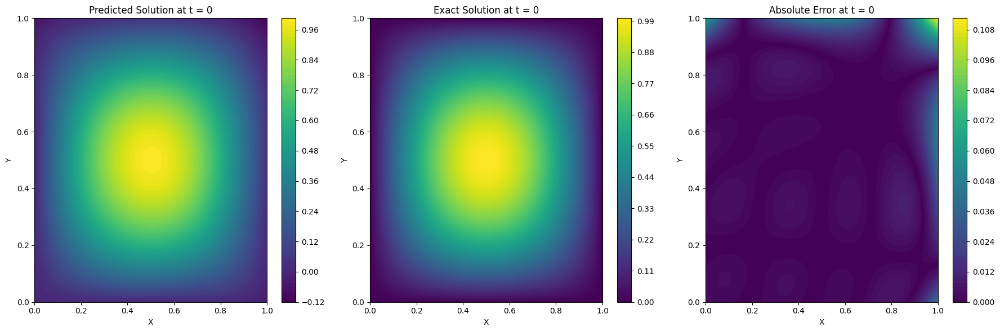

---

### 4. Schrödinger Equation

The PDE is $i h_t + \tfrac{1}{2} h_{xx} + |h|^2 h = 0$,  
IC: $h(0,x) = 2 \,\text{sech}(x)$,  
BC: periodic, $h(t,-5) = h(t,5), \; h_x(t,-5) = h_x(t,5)$.  

**Result:**  

  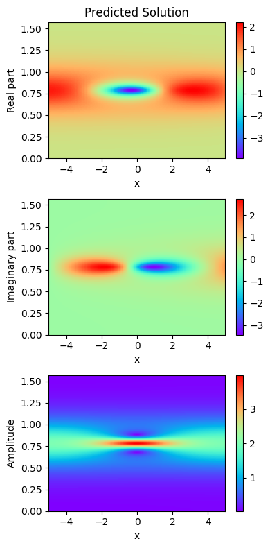
  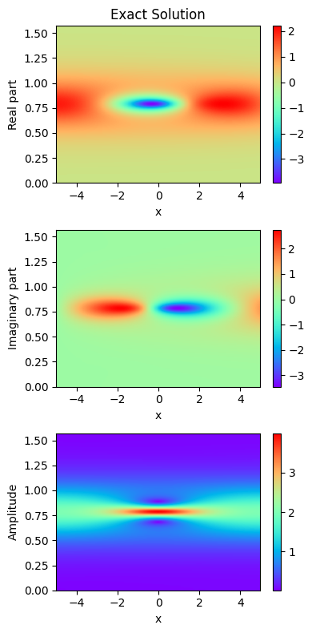
  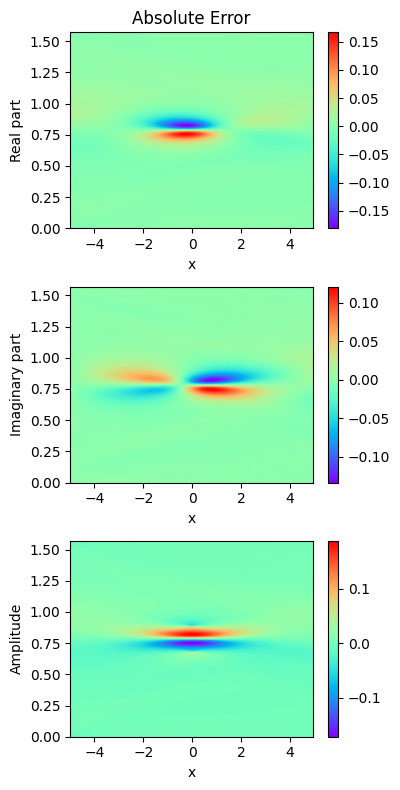

---

### 5. Burgers’ Equation

The PDE is $u_t + uu_x - \nu u_{xx} = 0$ with $\nu = 0.01/\pi$,  
IC: $u(0,x) = -\sin(\pi x)$,  
BC: $u(t,-1) = u(t,1) = 0$.  

**Result:**  

  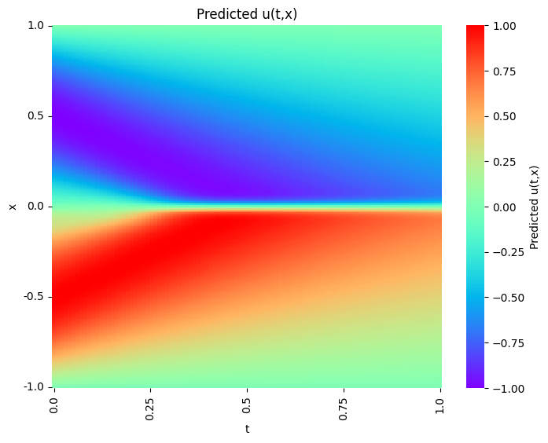
  
  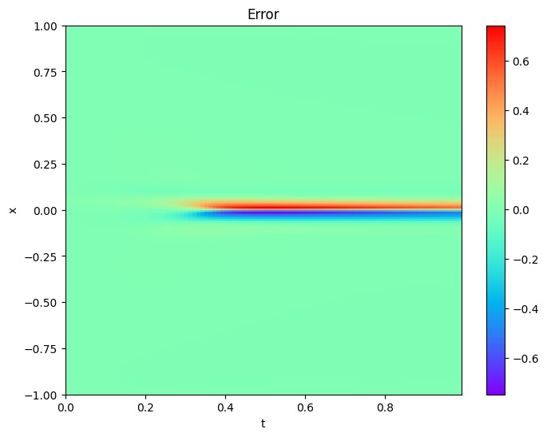

---

### 6. Allen–Cahn Equation

The PDE is $u_t = \nu u_{xx} + 5u - 5u^3$ with $\nu = 10^{-4}$,  
IC: $u(x,0) = \cos(\pi x)$,  
BC: $u(-1,t) = u(1,t)$.  

**Result:**  

  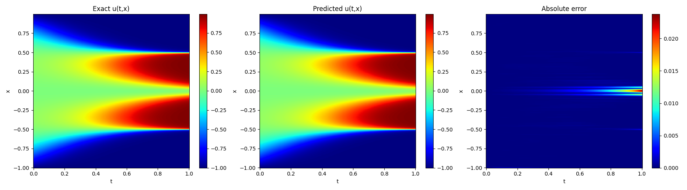
  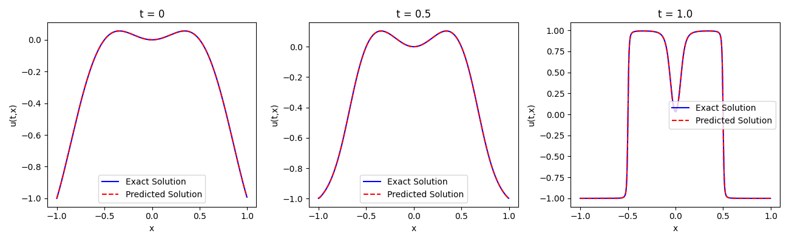

---

### 7. Lid-Driven Cavity Flow (Re = 100)

The PDEs are the 2D incompressible Navier–Stokes equations:  

$u u_x + v u_y + \tfrac{1}{\rho} p_x - \nu (u_{xx} + u_{yy}) = 0$,  
$u v_x + v v_y + \tfrac{1}{\rho} p_y - \nu (v_{xx} + v_{yy}) = 0$,  
$u_x + v_y = 0$.  

BC: top lid ($y=1$): $u = U, v = 0$; other walls: $u = v = 0$.  

**Result:**  
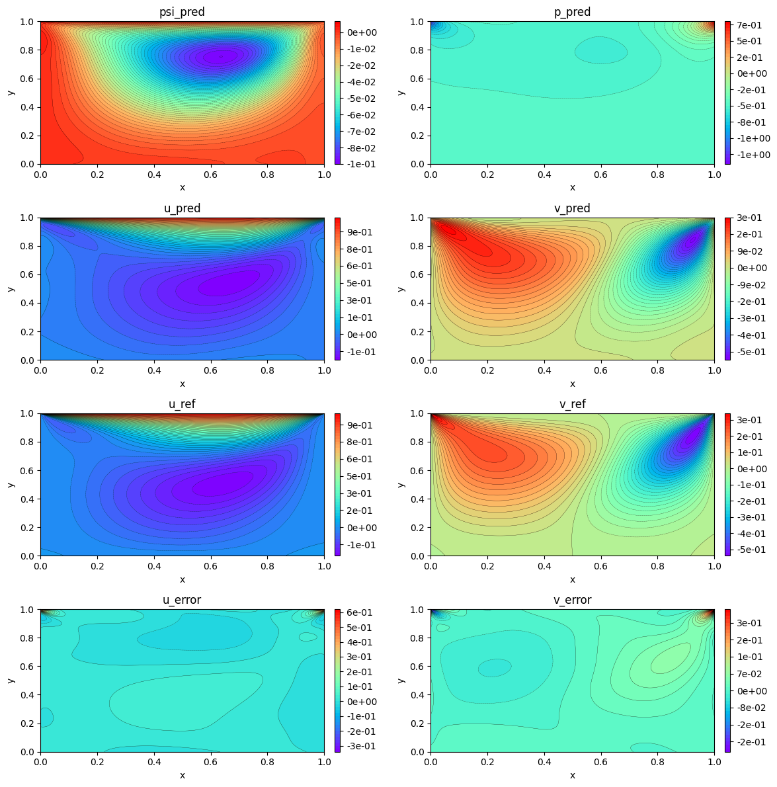

---

### 8. Thin Film Dewetting

The PDE is $H_t + \left(\tfrac{H^3}{H_0^3}(H_{xxx} + \Phi H_x)\right)_x = 0$,  
IC: $H(x,0) = 1 + 0.001 \cos\left(\tfrac{2\pi x}{L}\right)$,  
BC: periodic, $H(0,t) = H(L,t)$.  

**Result:**  
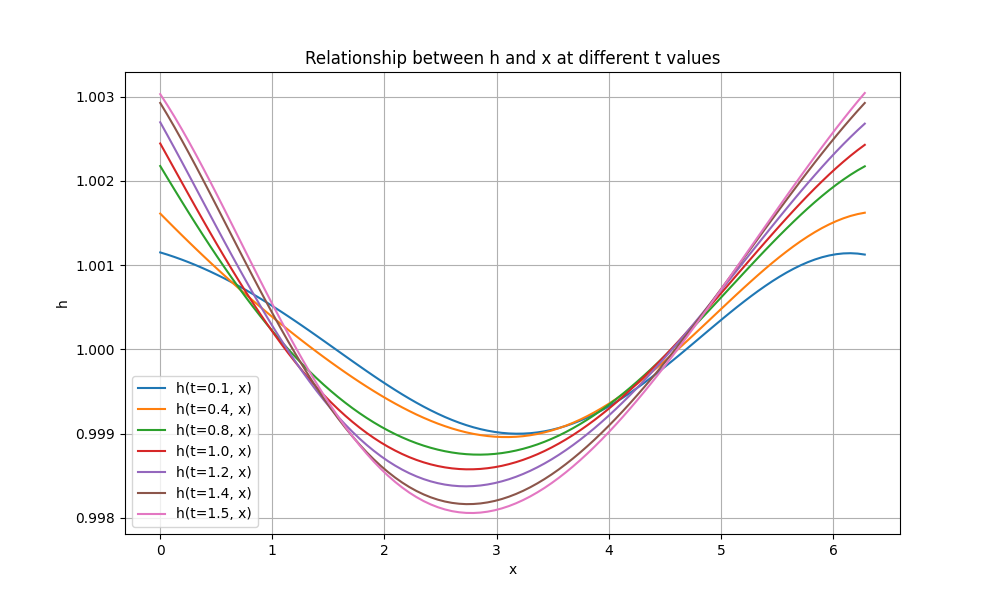

---

## Tech Stack
- Python  
- TensorFlow / PyTorch / JAX  
- Matplotlib for visualization  

---

## References
- Raissi, M., Perdikaris, P., and Karniadakis, G. E. (2019). Physics-Informed Neural Networks: A Deep Learning Framework for Solving Forward and Inverse Problems Involving Nonlinear PDEs. *Journal of Computational Physics*, 378, 686–707.    

---

## Author
Amitansu Das  
B.Tech, Chemical Engineering, Indian Institute of Petroleum and Energy
